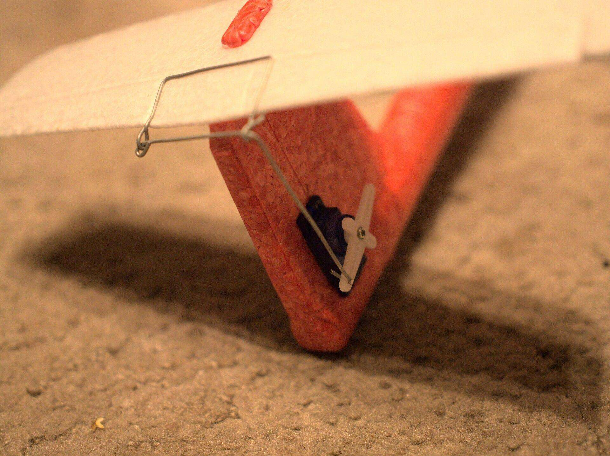

Python's Flying Circus
======================

This is pretty much the SIMPLEST, CRUDEST and CHEAPEST remote-controlled stuff
you can do, almost all by yourself, that will fly (kinda).

Obviously, you can buy something better. I've done it, because I've always felt
a need to do a flying remote controlled model. Finally fulfilled, I can do
something more productive.

Along the way, completely by accident, I've managed to learn about both:
Micropython and ESP-12S (ESP8266). Together they are a simple, fast to use and
simply beautiful duo. The avionics code is under 100 lines-of-code, the
controller - around 200.

I've scrubbed my initial idea of flying a rpi zero - for various good reasons.
I've never wanted to do it with AVR/STM32 + RFMxy because of a tedious
complexity and unfun debugging.

It took me 4 years to finish since I got the styrofoam base - but I estimate the
total work-days to be less than 4. The pandemic helped by allowing me to move to
the countryside for a while. I guess I should call it "Perseverance", but the
name seems taken. It's a busy year.

Parts
-----
- Larger styrofoam plane (mine has 49cm nose-to-tail)
- ESP-12S (other will work; ESP-12S has 4MB of flash, µPython is cool with
  1MB).
- 2x 5g servo for controlling ailerons (wing part)
- 1x servo (I had 9g, 5g would do) to controll the tail. I'm unsure if this is
  required.
- A lipo battery which can provide high current.
- A DC-DC step-up converter that stabilizes 3.3V from 2 - 5V (I used Pololu
  u1v10f3 converter which is tiny).
- Joystick or gamepad. You can try using an accelerometer in the laptop, or a
  mobile, or some touch screens. Go wild. Controlling it is hard though.
- Some glue, wires, soldering iron.
- Something to flash the ESP-12S (rpi, ftdi, some serial bridge).

If going for a powered craft and not a glider:
- 2x fast DC motor, for example for a small quadrocopter like hubsan.
- IRLZ44N - a mosfet for controlling power to the motors.
- A capacitor, 100nF, or 1uF - to limit noise (probably not needed)
- a schottky diode for limiting noise of switched selenoids in the motors (probably not needed)

Glider wasn't really fun. My total was 97 grams.

The wifi range between ESP and my laptop turned out to be more than required to
fly on the open area. I had more problems with the near by river or the gamepad
range than the wifi.

Steps
-----
Cut holes, glue servos, connect ailerons and elevator to servos. Connect wires,
solder stuff. Do a better job than I did.

Program the ESP-12S: Programming the ESP-12S requires some serial interface.
Like FTDI based USB bridge, or a raspberry pi. NodeMCU has the serial converter
included but is heavier. After flashing the micropython on the ESP with
esptool.py you can upload the code over the wifi and the serial is no longer
needed.

Put main.py and fly.py onto the ESP-12S using webrepl.

I suggest starting with gliding only and calibrate servos neutral position to
fly straight. Than calibrate the movement ranges so it responds, but remains
controllable. Gamepads have a short control range and need to be well
calibrated. I think.

Then enable motor power and use a fishing net to pick the plane out of the
river.

Media
-----

Pictures.

Moving pictures:
- 
- 

I was chasing a problem where the ESP was suddently turning off. I though that
was because of the noise, but it turned out that is was the overcurrent
protection in the battery which was triggered - partially because of noise,
mostly because of too high current. Capacitor helped a bit and I've left it
there.

With a better battery the thrust improved too:

